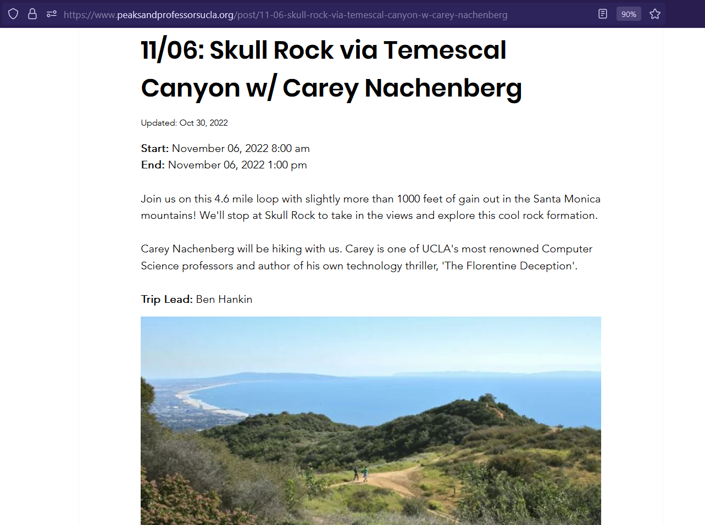
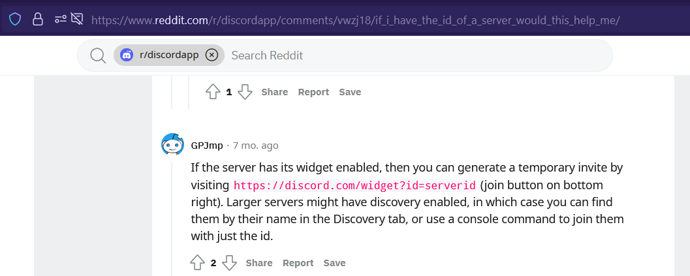
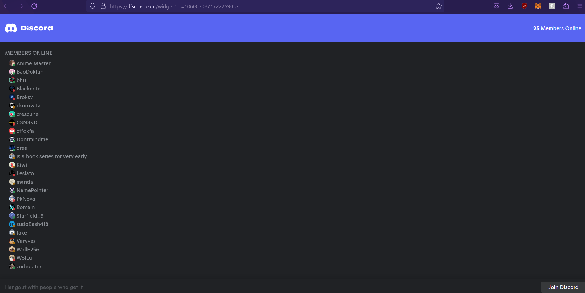
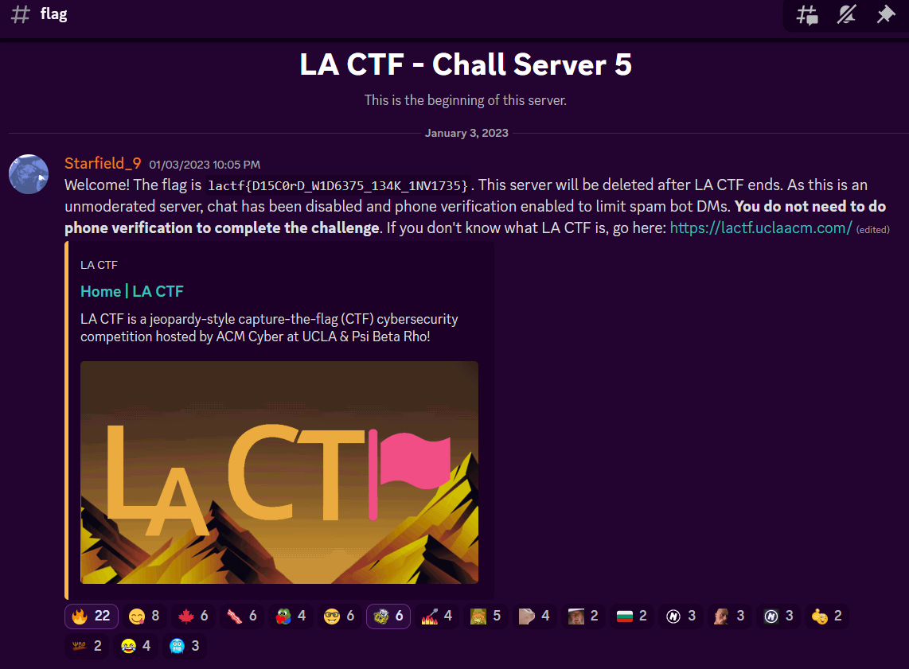
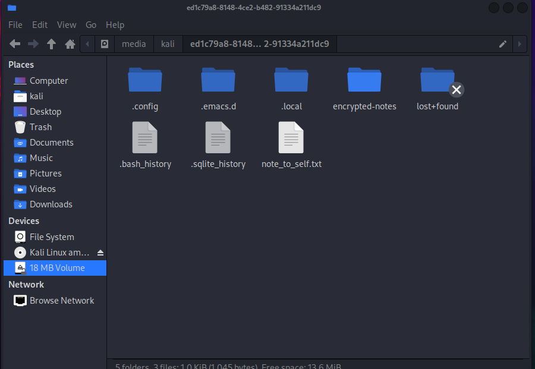
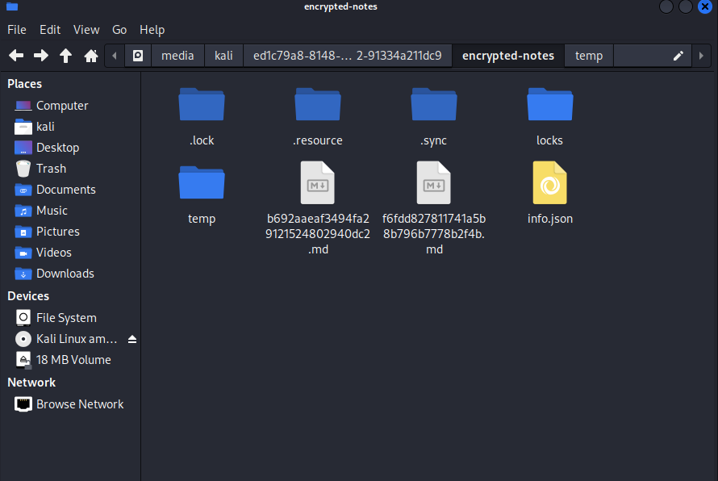
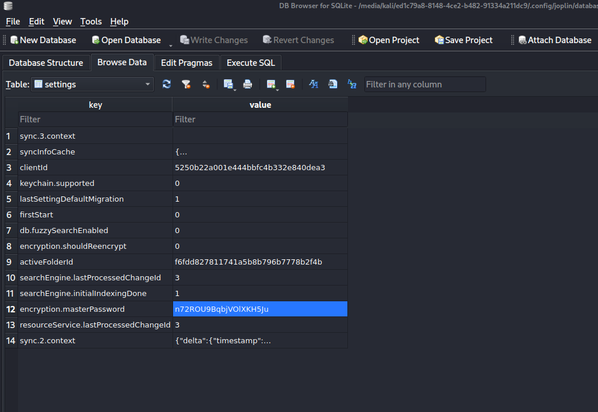
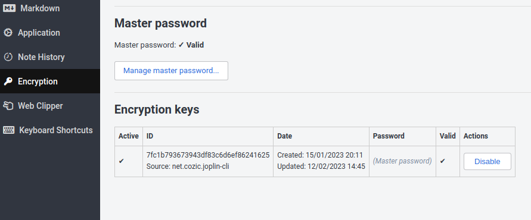
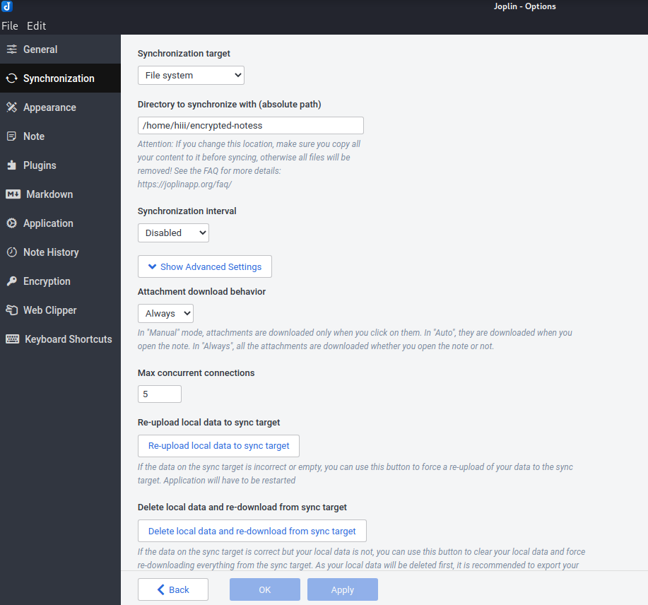
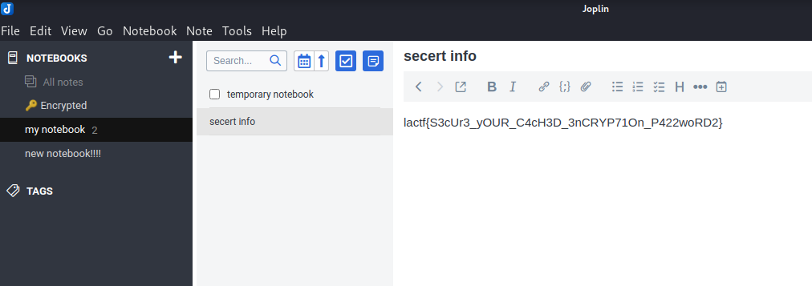

# LA CTF 2023

This was a great CTF hosted by ACM Cyber and Psi Beta Rho at UCLA (2nd best public university behind umich ofc). My team WolvSec finished in `20th` place out of `980` teams, and solved `35/46` challenges. I'll be going over the 3 `misc` challenges that I solved for our team.

[**misc/hike to where?** [209 solves]](https://github.com/dreeSec/la-ctf-2023/blob/master/LA-CTF-2023.md#mischike-to-where)  
[**misc/discord l34k** [142 solves]](https://github.com/dreeSec/la-ctf-2023/blob/master/LA-CTF-2023.md#miscdiscord-l34k)  
[**misc/a hacker's notes** [43 solves]](https://github.com/dreeSec/la-ctf-2023/blob/master/LA-CTF-2023.md#misca-hackers-notes)

# misc/hike to where?

Authors: `burturt`  
Points: **353**  
Solves: **209**

### Challenge Description:
Where was this photo taken? I think it used to be in the original photo, but someone cropped it out!

The flag is lactf{location}, where location is the name of the POI that this person hiked up to, all lowercase and replacing spaces with underscrolls. Use the google maps name of the POI: for example, if the solution is the UCLA Bruin Bear statue, [this](https://www.google.com/maps/place/UCLA+Bruin+Statue/@34.0709817,-118.4451726,21z) is the google maps location, and the flag would be lactf{bruin_statue}.

Please note: contacting anyone or any organization beyond official LA CTF support channels regarding this challenge is against the rules. Please be respectful of those who are involved in this challenge.


### Approach

<p align="center">

</p>

We are given this image of someone who looks like they hiked up a mountain, and also is part of computer science at UCLA. My first step was figuring out who this was, so just did a quick google search for "Computer science professors at UCLA"

<p align="center">

</p>

One of the first things I found is a [Quora article](https://www.quora.com/Who-is-the-best-computer-science-professor-at-UCLA) about him. So once I have the name I just google it, and then found his rock climbing website off that. Helped to confirm it was the same guy.

<p align="center">

</p>

I tried searching some of the mountains listed on Google Maps, but to no avail. I realized he didn't have hiking gear though unlike a lot of the photos on his website, but instead a UCLA T Shirt, signifying it could be a university trip. I came across [peaksandprofessorsucla.org](https://www.peaksandprofessorsucla.org/) which is a group of students at UCLA and professors. I looked at the blog posts with Carey Nachenberg, and found one about a trip to Skull Rock.

<p align="center">

</p>

I didn't really know if this was the exact place or not, but I went ahead and submitted that as the flag anyway and was correct! Anyways this was a weird OSINT challenge because I haven't had to deal with googling an actual person in a CTF, before this is more applicable to real world OSINT I guess?

Flag:  `lactf{skull_rock}`
<br/><br/><br/><br/>

# misc/discord l34k

Authors: `burturt`  
Points: **410**  
Solves: **142**

### Challenge Description:
My friend sent me [this](https://discord.com/channels/1060030874722259057/1060030875187822724/1060031064669700186) message link that apparently links to a "flag", but discord says "You don't have access to this link"! They did mention something about them being able to embed a list of online users on their own website, and sent me this image. Can you figure out how to join the server?

Note: Discord phone verification is NOT required for this challenge.

<p align="center">

<p>

### Approach

I first started looking at the message link to see what I could do with that

```
https://discord.com/channels/1060030874722259057/1060030875187822724/1060031064669700186
```

From messing around with other message links that I created, I noticed having the first number of the message link only, so `https://discord.com/channels/1060030874722259057` for example, would take you to the server it belonged to **only if** you are a member. From more research I discovered that this was the server ID. 

Ok cool, but how do we join a server with this? Well after more research I stumbled across [this Reddit post](https://www.reddit.com/r/discordapp/comments/vwzj18/if_i_have_the_id_of_a_server_would_this_help_me/) that just so happens to explain what to do when a widget is enabled, and you have the server ID. 

<p align="center">

</p>

Using this the link would be:

```
https://discord.com/widget?id=1060030874722259057
```
<p align="center">

</p>

And this Works! We can see here that the widget looks the same as the one pictured.

<p align="center">

</p>

From that we hit join, and we get the flag!

Flag: `lactf{D15C0rD_W1D6375_134K_1NV1735}`
<br/><br/><br/><br/>

# misc/a hacker's notes

Authors: `burturt`  
Points: **478**  
Solves: **43**

### Challenge Description:
We managed to get ahold of a flash drive which we think contains the decryption keys for the ransomware that a hacker group tried to deploy on our computer network! However, it seems like the hacker encrypted the flash drive. We know that the organization uses passwords in the format `hacker###` (hacker + 3 digits) for their disks, but a much stronger encryption password once you login. Can you try to get access to their notes?

### Approach
So we are given a dd file, which should be a disk image file. To check, we can run the `file` command.

```console
┌──(kali㉿kali)-[~/Downloads/hackers-drive]
└─$ file hackers-drive.dd 
hackers-drive.dd: LUKS encrypted file, ver 1 [twofish, cbc-plain, sha1] UUID: 456aa573-ab59-4146-a2f3-874a808b9c08
```

This drive appears to be encrypted, which is also told by the challenge description. However, we know there are only 1000 variations. We can write a quick python script that outputs all of these:

```python
for (char1) in range (10):
    for (char2) in range (10):
        for (char3) in range (10):
            print("hacker" + str(char1) + str(char2) + str(char3))
```

We can crack this LUKS encrypted file with `hashcat` as follows:

```console
┌──(kali㉿kali)-[~/Downloads/hackers-drive]
└─$ hashcat -m 14600 -a 0 -w 3 hackers-drive.dd wordlist.txt
hashcat (v6.2.5) starting

...

Approaching final keyspace - workload adjusted.           

hackers-drive.dd:hacker765                                
                                                          
Session..........: hashcat
Status...........: Cracked
Hash.Mode........: 14600 (LUKS)
Hash.Target......: hackers-drive.dd
Time.Started.....: Sun Feb 12 20:49:18 2023 (1 sec)
Time.Estimated...: Sun Feb 12 20:49:19 2023 (0 secs)
Kernel.Feature...: Pure Kernel
Guess.Base.......: File (wordlist.txt)
Guess.Queue......: 1/1 (100.00%)
Speed.#1.........:     1953 H/s (9.55ms) @ Accel:512 Loops:1024 Thr:1 Vec:8
Recovered........: 1/1 (100.00%) Digests
Progress.........: 1000/1000 (100.00%)
Rejected.........: 0/1000 (0.00%)
Restore.Point....: 0/1000 (0.00%)
Restore.Sub.#1...: Salt:0 Amplifier:0-1 Iteration:1024-1085
Candidate.Engine.: Device Generator
Candidates.#1....: hacker0 -> hacker999
Hardware.Mon.#1..: Util: 38%

```

Cool! Hashcat told us that the password for the encrypted drive is `hacker765`. From this we can run `cryptsetup` to decrypt the drive, then just double click the output and kali will mount it for us!

```console
┌──(kali㉿kali)-[~/Downloads/hackers-drive]
└─$ sudo cryptsetup open --type luks hackers-drive.dd hackers-drive
Enter passphrase for hackers-drive.dd: [ENTER hacker765 HERE]
```
<p align="center">

</p>

Alright, let's see what we have. Upon entering the drive we see some text files that contain command history and other important notes.

Inside `.bash_history` we see:

```console
joplin
cd .config/joplin
ls -lah
sqlite3 database.sqlite 
ls
ls -lah
cat database.sqlite | grep lactf
cd ..
cd ..
ls
ls -lah
nano note_to_self.txt
ls -lah
ls
zerofree /dev/mapper/notes
exit
```

Ok so we are dealing with notes being taken on [Joplin](https://joplinapp.org/), an open source note-taking app. `joplin` initializes the notebook and `.config` folder, and our hacker here then enters the database that joplin uses. We can see their edit history in the `.sqlite_history` file:

```sql
.tables
select * from notes;
select * from *;
select * from notes_fts;
select * from qexit
exit
.exit
;
exit
;
.exit
.tables
select * from notes;
delete from notes;
select * from notes;

...

select count(*) from notes;
vacuum;
.exit
.exit
pragma secure_delete;
select * from notes_normalized;
delete from notes_normalized;
select * from notes_normalized;
vacuum;
.exit
```

Looks like they are deleting their notes from the database, as hackers do. They nicely lay out their process in the `note_to_self.txt` file:
```
Note to self: delete notes and notes_normalized tables in .config/joplin/database.sqlite when not in use; allow encrypted sync to restore notes after
```
This matches up with the history files we just looked at, where the hacker is creating notes, then erasing them. Also shown by `zerofree /dev/mapper/notes`. Now time to figure out how to get these notes back! One of the first things I tried was just `cat database.sqlite | grep -a 'lactf'` in the `.config` folder, and we get this:

```console
┌──(kali㉿kali)-[/media/kali/ed1c79a8-8148-4ce2-b482-91334a211dc9/.config/joplin]
└─$ cat database.sqlite | grep -a 'lactf'
3ncryp71onc4ch3dinfolactf       p422word2s3cur3ecert�n0 113
3ncryp71onc4ch3dinfolactf       p422word2s3cur3ecertyo40 20infosec@0 26infosecert
```

Interesting. This looks somewhat like the flag format? I tried for a while to rearrange this into something like `lactf{p422word_2_s3cur3_your_3ncryp71on_c4ch3d_info}`. But no flag :( wasn't going to be this easy. After more checking I discovered this was just some residue data that comes from creating a note that the database saved, but the capitalization and punctuation is not correct. But hey! We know the flag is here assuming this isn't bait.

Let's take a look at that `encrypted-notes` folder:

<p align="center">

</p>

We see here two markdown files and `info.json` This json file contains encryption of the master keys. According to Joplin's [E2EE Spec](https://joplinapp.org/spec/e2ee/) the master keys are themselves encrypted. 

The markdown files look like such:

```
id: f6fdd827811741a5b8b796b7778b2f4b
created_time: 
updated_time: 2023-01-16T01:07:30.122Z
user_created_time: 
user_updated_time: 
encryption_cipher_text: JED01000022057fc1b793673943df83c6d6ef862416250002d0{"iv":"EJ1h/RpLa3kHQshwbAzg/w==","v":1,"iter":101,"ks":128,"ts":64,"mode":"ccm","adata":"","cipher":"aes","salt":"t+kHfSSLUOk=","ct":"8rNT3WgTYYHbeXFvYNiebAD1Lz0lcmMBGjVoEe2vic0sTV8nzUUmP1gBVA/R7oCyOQLbcGrXc1hl1amvVE/Lln8erhqi1+tje9Amx+0tZPcwpQKiIht2hQmCqzBbCEYQ9f0OjFS01wJTTPl9M9PgIRc2eNvmN5VYCOiq3TqHOeBgiiyKFhXTd/1Xpbv++Y58M9Nombzmx3lRujjF2LAKUaYnO33BRQ7EJoadjqNE0PBNeMvZRBxsdt2Y2VmV3evWkA8htlf5R/Zhe8Di4CPupFJgBDF2j9P7R27f3UcrWzauqlLi4BfSjYggTQGe0YdxOJxHxXZIZX0KHqsTtpYXZDgnj0g4AkxDVBQhxJVQObdo/u8JUQofHLCZyyD2pn8A6cYF7QbItz3J9flQVtZw59UtLq2Oiip6OCWj75xLy48EqEtUjQsXY5AidrCR36S7fPsVilSCXBWX6x+43xArg+rMCAnColo+0XW/Beu+OHUPEkUl60pvuPcwiVo2tmR3Niiq+M2Fy+dpYfdH7pCqnIdKOJCrm/MGKGJyLYjlwYqhXwoKs32tVsNyhxFl1c3feZwCOw=="}
encryption_applied: 1
parent_id: 
is_shared: 
share_id: 
master_key_id: 
icon: 
type_: 2
```
With the other file having the header:
```
id: b692aaeaf3494fa29121524802940dc2
parent_id: f6fdd827811741a5b8b796b7778b2f4b
```
As well as a similar body. This indicates that this file likely is a note as part of the parent notebook.

I first tried to decrypt this with this [SJCL demo](https://bitwiseshiftleft.github.io/sjcl/demo/) that's the same scheme Joplin uses, as per the spec. 

But what password do we use to decrypt these encrypted notes? That comes to the second part of the challenge description, where there's `a much stronger encryption password once you login`. Well the master password is actually stored in cleartext in the database file!

<p align="center">

</p>

I tried using variations of this and the password found in `info.json` (which is also in `syncInfoCache` in the database) on the SJCL demo website, but to no avail. This is probably possible, but why make this harder than it needs to be? Let's just download our own version of Joplin and replace the database file! Swapping out important parameter values should also work, like the `syncInfoCache`, `encryption.masterPassword`, and `sync_items`.

Once you're in Joplin make sure the Encryption Keys look as such:

<p align="center">

</p>

Then, make sure the Synchronization target is on the file system and pointed to the `encrypted-notes` folder, or a copy of it.

After all this is done, select the `Delete local data and re-download from sync target` to sync the new data into Joplin!

<p align="center">

</p>

There we go! We can see the *secert info* that the hacker was keeping from us.

<p align="center">

</p>

Flag: `lactf{S3cUr3_yOUR_C4cH3D_3nCRYP71On_P422woRD2}`

### Thoughts
This challenge was a good one, and took up a lot of my time this CTF. I learned a lot about the importance of documenting your findings, considering every clue thrown at you without falling into rabbit holes of overthinking, and ensuring integrity of the files for data you're given. Trying to sync the encryption notes should have been more of a priority in retrospect, instead of trying to decipher the encryption files manually.
